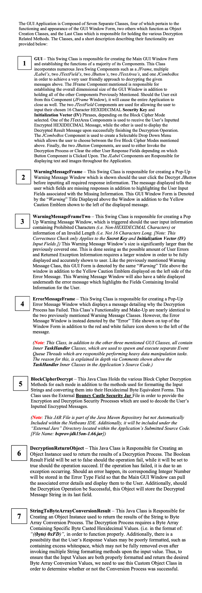

# 🛡️ DES Decryption Tool

[](https://www.oracle.com/java/technologies/javase-downloads.html)
[](LICENSE)
[](https://github.com/tmfontan/DESDecryptionTool/commits/main)
[](https://github.com/tmfontan/DESDecryptionTool)
[](https://github.com/tmfontan/DESDecryptionTool/issues)

A **Java Swing** desktop application for decrypting messages encrypted with the **Data Encryption Standard (DES)** across multiple cipher modes.  
Designed with a clean and intuitive GUI, it provides real-time input validation, clear error handling, and accurate decryption results.

---

## 📖 Overview

The **DES Decryption Tool** bridges cryptographic theory with practical implementation.  
It enables users to:

- Enter a **DES key**
- Select a **cipher mode** (e.g., ECB, CBC, etc.)
- Provide an **Initialization Vector (IV)** if required
- Paste **ciphertext** to decrypt

The application validates all inputs, displays actionable messages for corrections, and outputs the decrypted plaintext.

---

## ✨ Features

- **User-Friendly Interface** – Built with Java Swing for a responsive and intuitive desktop experience.  
- **Multiple Cipher Mode Support** – Includes ECB, CBC, and other DES-compatible modes.  
- **Real-Time Input Validation** – Catches missing or invalid entries before processing.  
- **Detailed Error Handling** – Offers clear, actionable feedback for troubleshooting.  
- **Lightweight & Portable** – Simple JAR execution; no complex setup required.  

---

## 🚀 Getting Started

### Prerequisites
- **Java JDK** 8 or higher  
- **Apache NetBeans 11.2** (recommended) or another Java IDE

### Installation
```bash
git clone https://github.com/tmfontan/DESDecryptionTool.git


# DES Decryption Tool
A Java Swing GUI Application that is able to decrypt user inputted cipher text which is encrypted via one of the various Stream / Block Ciphers Modes included within the Data Encryption Standard (DES). This GUI Tool Allows for a user input their chosen ***Security Key***, ***Cipher Mode***, ***Initialization Vector (IV)***, and ***Cipher Text Message*** before using the data to output the Decrypted Result Message. Additionally, the DES Decryption Tool Application provides detailed Error / Warning Messages should something go wrong during the Decryption Process or the user inputs Invalid / Missing Response Information. These Error / Warning Messages will be used to inform the user of the exact reason for the Decryption Process's Failure or lack of Launching.

*(**Note:** This Application was Designed and Tested Using the **Apache Netbeans 11.2** Integrated Development Environment)*

**A detailed explanation of the Java Classes contained within the project in Addition to Multiple Screenshots of the Application's Functionality are shown below:**





