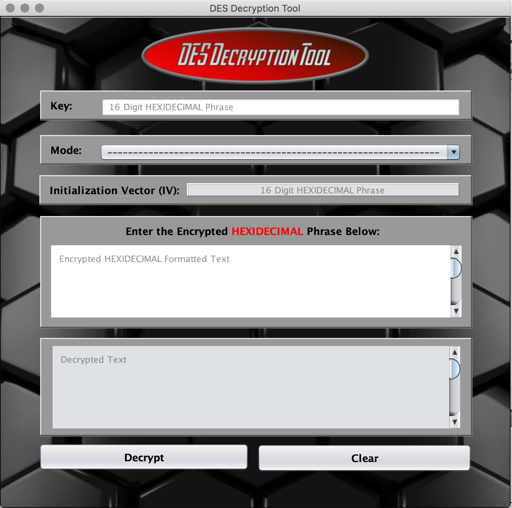

# DES Decryption Tool
A Java Swing GUI Program that is able to decrypt user inputted cipher text which is encrypted via one of the various Stream / Block ciphers included within the Data Encryption Standard Cipher Mode (DES).  This GUI Tool Allows for a user input their chosen Security Key, Cipher Mode, Initialization Vector, and Cipher text. Additionally, it provides detailed Error Messages should something go wrong in the Decryption Process.
https://github.com/tmfontan/DESDecryptionTool.git/

