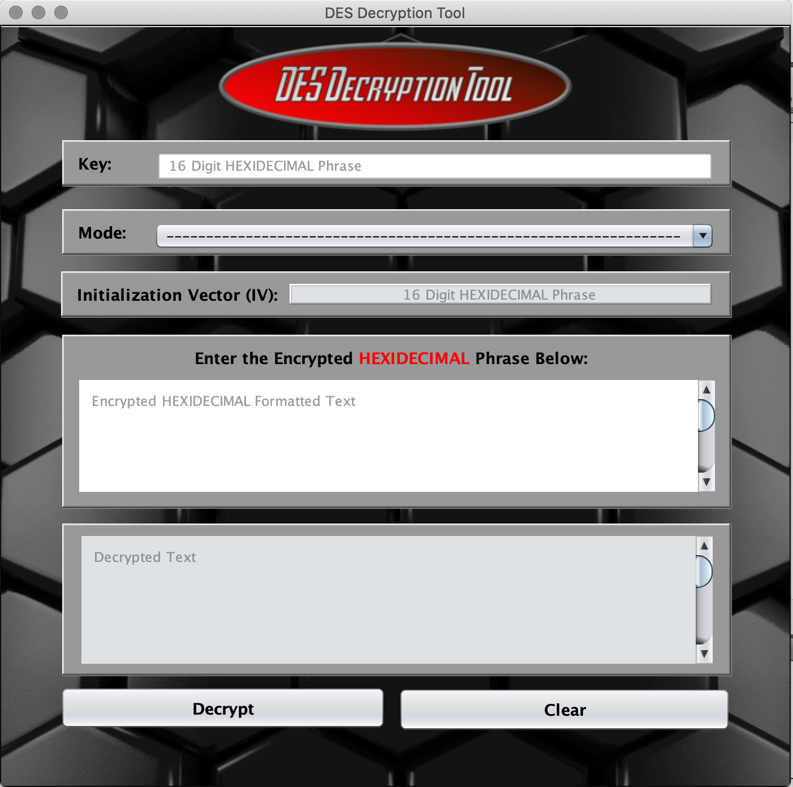
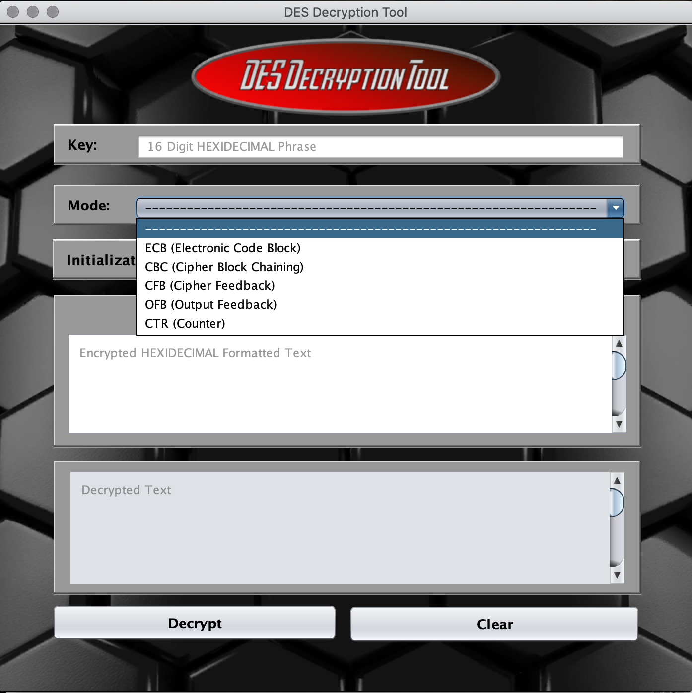
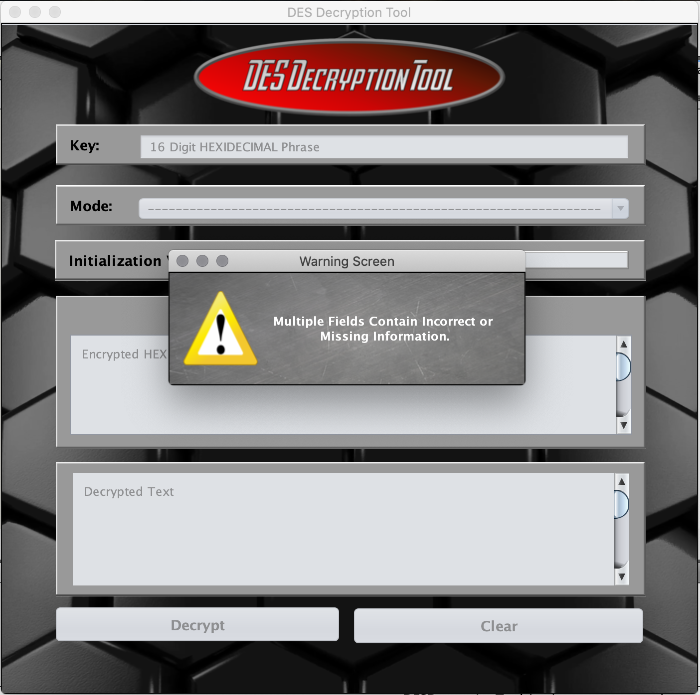
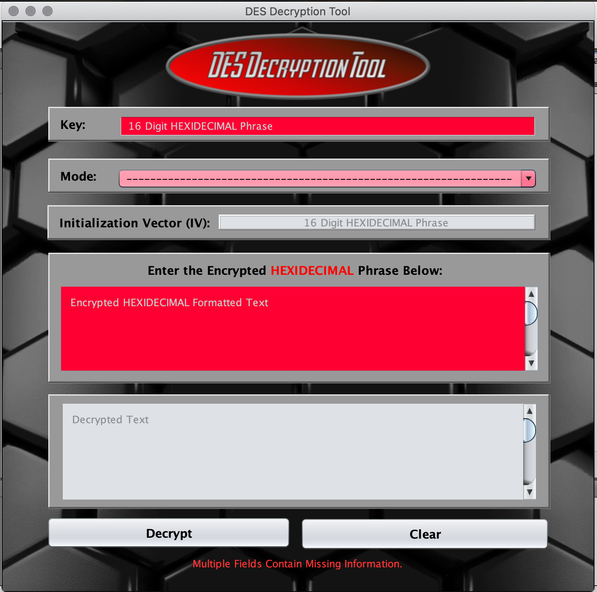
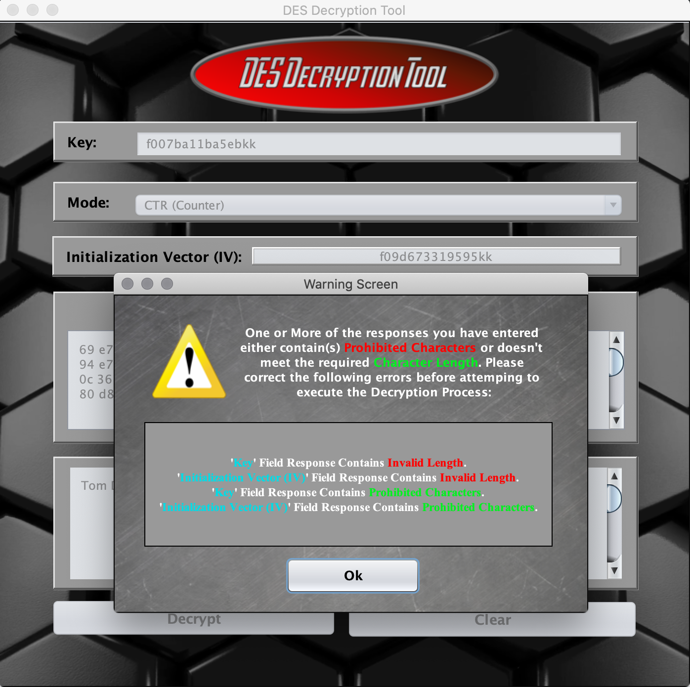
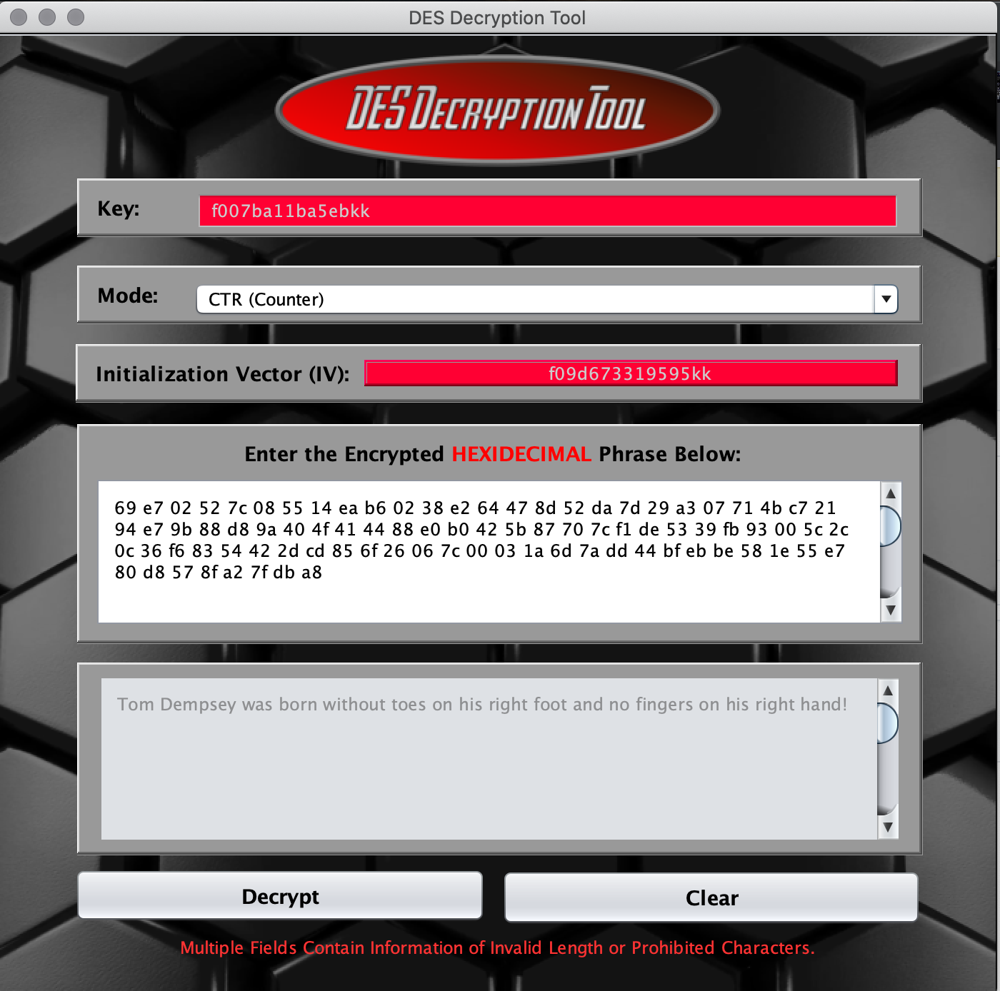
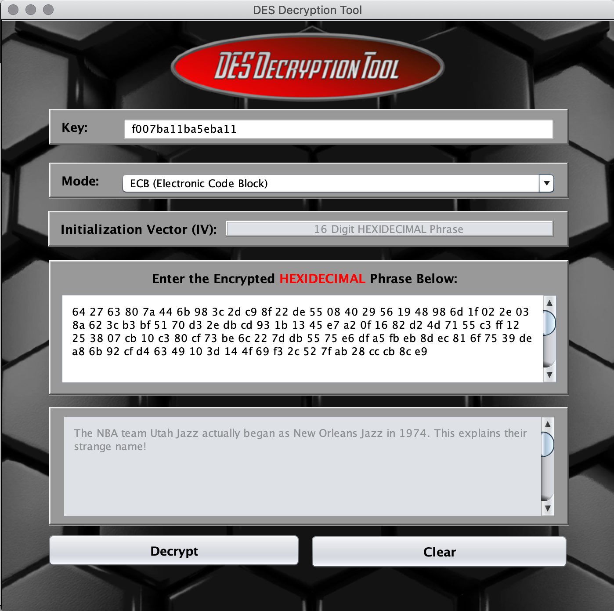
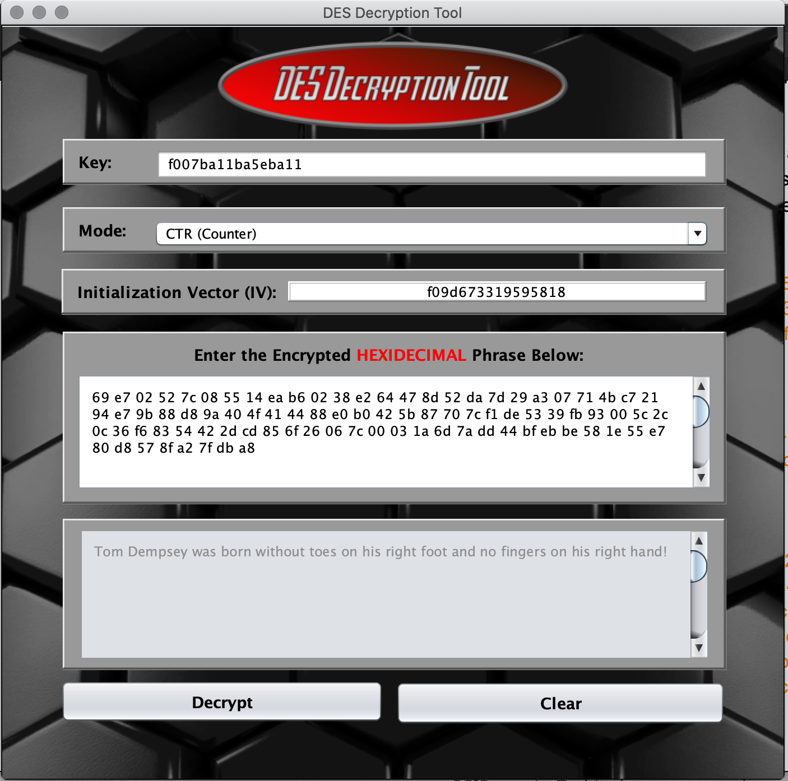

# 🛡️ DES Cipher Decryption Utility

<p align="center">
  
</p>

&#x20;     &#x20;

A **Java Swing** desktop application for decrypting messages encrypted with the **Data Encryption Standard (DES)** across multiple cipher modes. Designed with a clean and intuitive GUI, it provides real-time input validation, clear error handling, and accurate decryption results.

---

## 📖 Overview

The **DES Decryption Tool** bridges cryptographic theory with practical implementation. It enables users to:

- Enter a **DES key**
- Select a **cipher mode** (e.g., ECB, CBC)
- Provide an **Initialization Vector (IV)** if required
- Paste **ciphertext** to decrypt

The application validates inputs, provides actionable error messages, and displays the decrypted plaintext.

---

## ✨ Features

- **User-Friendly Interface** – Built with Java Swing for a responsive and intuitive desktop experience.
- **Multiple Cipher Mode Support** – Includes ECB, CBC, and other DES-compatible modes.
- **Real-Time Input Validation** – Detects missing or invalid entries before processing.
- **Detailed Error Handling** – Provides clear, actionable troubleshooting feedback.
- **Lightweight & Portable** – Simple JAR execution; no complex setup required.

---

## 🚀 Getting Started

### Prerequisites

- **Java JDK 8+**
- **Apache NetBeans 11.2** (recommended) or another Java IDE

### Installation

```bash
git clone https://github.com/tmfontan/DESDecryptionTool.git
```

> **Note:** This application was designed and tested using **Apache NetBeans 11.2**.

---

## ⚡ Usage

1. Launch the application.
2. Enter your **DES key**.
3. Select the desired **cipher mode**.
4. Provide an **Initialization Vector (IV)** if the mode requires it.
5. Paste your **ciphertext** into the input field.
6. Click **Decrypt** to view the plaintext result.

---

## 📸 Screenshots

### Initial Interface


### Cipher Mode Selection


### Warning Messages





### Decryption Results



---

## 🛠️ Class Structure

The GUI application is composed of **seven separate classes**:

1. **[GUI](https://github.com/tmfontan/DESDecryptionTool/blob/main/src/GUI.java)**  
   - Responsible for creating the main GUI window form and handling most of the component functionality.  
   - Uses **Swing components** such as `JFrame`, `JLabel`, `JTextField`, `JButton`, `JTextArea`, and `JComboBox`.  
   - Provides fields for entering the **16-character HEX Security Key** and **Initialization Vector (IV)** depending on cipher mode.  
   - Includes input and output text areas, a cipher mode dropdown, and buttons to decrypt or clear inputs.  
   - Ensures a user-friendly layout for decrypting messages.  

2. **[WarningMessageFrame](https://github.com/tmfontan/DESDecryptionTool/blob/main/src/WarningMessageFrame.java)**  
   - Creates a **pop-up window** shown when the user attempts decryption without filling in all required fields.  
   - Displays which fields are missing and highlights the missing input fields.  
   - Denoted by the title **“Warning”** and includes a yellow caution emblem.  

3. **[WarningMessageFrameTwo](https://github.com/tmfontan/DESDecryptionTool/blob/main/src/WarningMessageFrameTwo.java)**  
   - Displays warnings for **invalid input**, such as:  
     - Non-hexadecimal characters  
     - Invalid key or IV length (not 16 characters)  
   - Larger than the first warning window to display detailed error messages.  
   - Titled **“Warning”**, with a caution emblem and a message table listing all invalid fields.  

4. **[ErrorMessageFrame](https://github.com/tmfontan/DESDecryptionTool/blob/main/src/ErrorMessageFrame.java)**  
   - Handles **decryption failure errors**.  
   - Similar design to the warning frames but titled **“Error”**, with a red/white failure icon.  
   - Used to display reasons for failed decryption attempts.  

   > **Note:** These GUI classes (and others) also contain **TaskHandler inner classes** that spawn and execute separate event queue threads for heavy data manipulation. This is explained further in the source code via comments.

5. **[BlockCipherDecrypt](https://github.com/tmfontan/DESDecryptionTool/blob/main/src/BlockCipherDecrypt.java)**  
   - Contains decryption methods for different DES cipher modes.  
   - Formats input strings and converts them into their hexadecimal byte-equivalent forms.  
   - Uses the external **Bouncy Castle Security JAR** (`bcprov-jdk15on-1.66.jar`) for cryptographic operations.  
   - Provides the encryption and decryption logic for processing encrypted messages.  

   > **Note:** The JAR file comes from Maven but is **not included by default** in NetBeans. It must be added manually under the project’s `External Jars` directory.  

6. **[DecryptionReturnObject](https://github.com/tmfontan/DESDecryptionTool/blob/main/src/DecryptionReturnObject.java)**  
   - Creates object instances to return results from a decryption attempt.  
   - Returns:  
     - A **Boolean flag** indicating success or failure.  
     - An **error code** and details if an exception occurs.  
     - The **decrypted plaintext** if successful.  
   - Allows the GUI to display clear results or errors to the user.  

7. **[StringToByteArrayConversionResult](https://github.com/tmfontan/DESDecryptionTool/blob/main/src/StringToByteArrayConversionResult.java)**  
   - Responsible for converting strings to byte arrays for decryption.  
   - Handles hex string parsing, including tricky cases like extra whitespace.  
   - Ensures formatting is correct before passing values into decryption.  
   - Returns conversion results as objects, including failure information if input was poorly formatted.  

---

## 🗺️ Roadmap

Planned enhancements and future improvements:

- [ ] Add **support for Triple DES (3DES)** decryption.
- [ ] Implement **file-based decryption** for batch processing.
- [ ] Introduce a **dark mode UI theme** for better accessibility.
- [ ] Provide **export functionality** to save decrypted text directly to files.
- [ ] Add **automated unit tests** to improve reliability and maintainability.

---

## 🤝 Contributing

Contributions are welcome! If you’d like to improve this project:

1. Fork the repository.
2. Create a new branch: `git checkout -b feature-name`.
3. Make your changes and commit: `git commit -m "Add feature"`.
4. Push to your branch: `git push origin feature-name`.
5. Submit a pull request.

Please ensure your contributions align with the project’s coding style and include relevant documentation or updates to the README if necessary.

---

## 📜 License

This project is licensed under the [MIT License](LICENSE).

