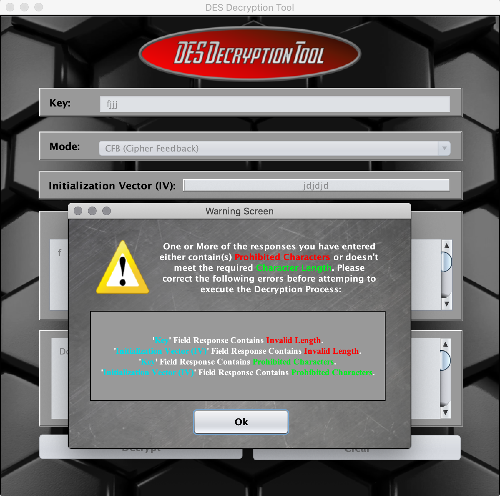

# DES Decryption Tool
A Java Swing GUI Application that is able to decrypt user inputted cipher text which is encrypted via one of the various Stream / Block Ciphers Modes included within the Data Encryption Standard (DES). This GUI Tool Allows for a user input their chosen Security Key, Cipher Mode, Initialization Vector (IV), and Cipher Text Message before using the data to output the Decrypted Result Message. Additionally, the DES Decryption Tool Application provides detailed Error / Warning Messages should something go wrong during the Decryption Process or the user inputs Invalid / Missing Response Information. These Error / Warning Messages will be used to inform the user of the exact reason for the Decryption Process's Failure or lack of Launching.

*(Note: This Application was Designed and Tested Using the **Apache Netbeans 11.2** Integrated Development Environment)*

**A detailed explanation of the Java Classes contained within the project in Addition to Multiple Screenshots of the Application's Functionality are shown below:**

